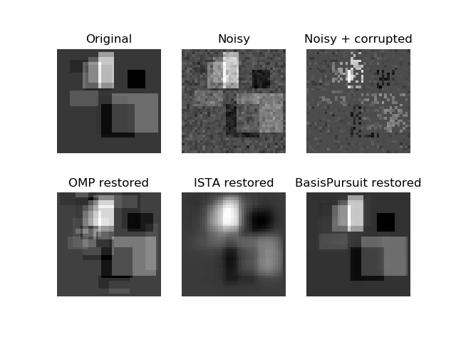
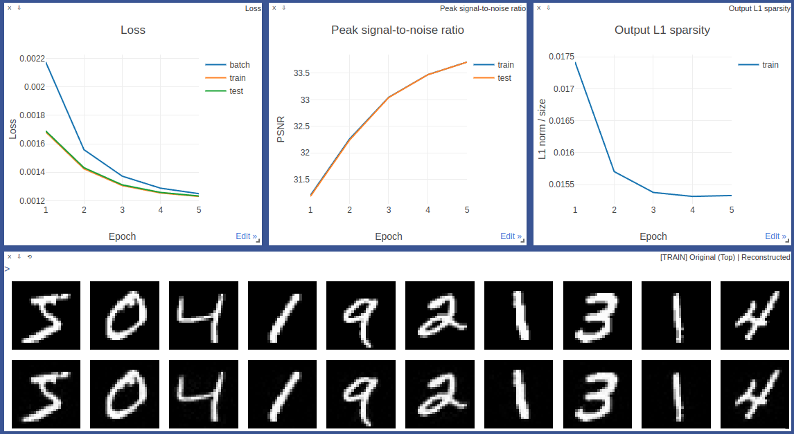

# Sparse Representation Algorithms

Python functions to analyze sparse representations by solving the P0- and P1-problems.

1. P0-epsilon problem: `min_z ||z||_0 s.t. ||Az - x|| < eps`
2. P1-epsilon problem: `min_z ||z||_1 s.t. ||Az - x|| < eps`
3. Q1-epsilon problem: `min_z ||Az - x||^2 + λ||z||_1`

where `z` is a sparse representation of the input `x`, and `A` is a dictionary matrix (either fixed or learned).

Documentation is available at https://sparse-representation.readthedocs.io

The theoretical foundations of the implemented functional are in edX course
[Sparse Representations in Signal and Image Processing](
https://courses.edx.org/courses/course-v1:IsraelX+236862.1x+3T2019/course/).


## Algorithms

### Coherence of a matrix

* Mutual Coherence
* Babbel Function
* Spark of a matrix


### Solving P0- and P1-epsilon problems with a fixed dictionary

* Greedy algorithms, approximating the P0-problem:
    * Orthogonal Matching Pursuit (OMP)
    * Least Squares OMP (LS-OMP)
    * Matching Pursuit (MP)
    * Weak Matching Pursuit (WMP)
    * Thresholding Algorithm (THR)
* Relaxation algorithms, approximating the P0-problem:
    * Basis Pursuit (L1-relaxation)
    * Basis Pursuit + ADMM
    * Iterative Shrinkage Algorithm (ISTA, Fast ISTA)


### Dictionary learning

* BasisPursuit dictionary learning (similar to MOD)  
* Learned Iterative Shrinkage-Thresholding Algorithm (LISTA)

`sparse.nn` module contains PyTorch implementation of the listed above algorithms.

## Quick start example

### Fixed dictionary

Reproduce with [`edX/finproj/project2_all.py`](edX/finproj/project2_all.py)

To illustrate an example with a fixed dictionary, we 

1) simulate an image `x` of size `n x n`, constructed with bars;
2) add noise and corrupt the image -> `x_noisy`;
3) generate a fixed dictionary matrix `A` of size `n^2 x m` (`m >> n^2`) with random bars as atoms (columns);
4) reconstruct `x'` from `x_noisy` by seeking the sparsest vector `z` such that `Az ≈ x`.



### Learned dictionary

Start a Visdom server and run the examples with

```
$ python -m visdom.server
$ python sparse/examples/basis_pursuit_pytorch.py
```

Then navigate to localhost:8097 to see the training progress.

More examples are at http://visdom.kyivaigroup.com:8097. Choose environments with `MatchingPursuit`.



The "output sparsity" is the sparsity of the embedding vector from which the original image is reconstructed.


## Installation

```
$ git clone https://github.com/dizcza/sparse-representation.git
$ cd sparse-representation
$ pip install -e .[extra]
```

Extra requirements install PyTorch for `sparse.nn` module.
